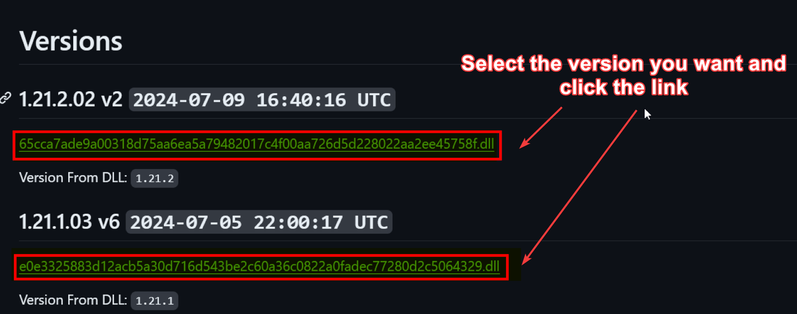
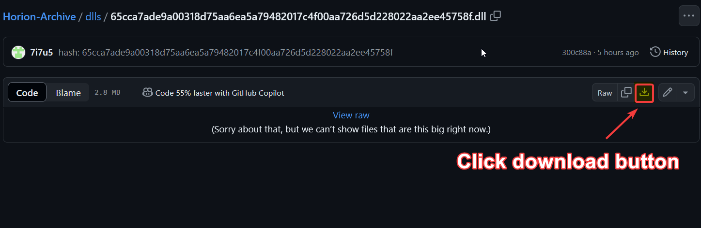
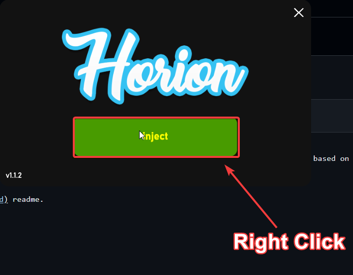
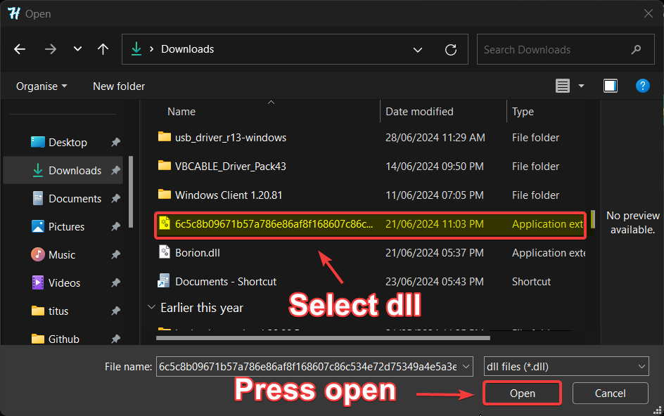

# Step 1:
go to [Info](info.md) and find the version that you want to download.
> 
# Step 2:
Click on the link under the version header and then click the download icon.
> 
# Step 3:
Open horion injector and RIGHT CLICK on the inject button.
> 

# Step 4:
Select the dll you downloaded and click open.
It will not be injected
> 

# Horion Archiver
This tool is used to archive versions of the horion dlls. It uses the file hash to detect if its a new dll and will guess the mc version for the dll based on the current mc version and previous dll versions.

To see information about each dll (such as its version) go to the [Info](info.md) readme.

If you would like a version added that isnt already stored, create an issue.
